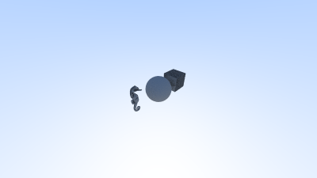

# Ray tracing in c++

## About the project
This project aims to implement the ray tracing computer graphics algorithm developed throughout the computer graphics course
### Classes
Throughout the project, specific classes were implemented for each component that will be used in the construction of the ray tracing system. These include:
- [camera](./docs/camera.md): The `camera` class represents a virtual camera for rendering scenes. It utilizes the Ray Tracing technique to generate images based on the specified scene and camera parameters.
- [face](./docs/face.md): The `Face` class represents a face in a 3D model, commonly used in computer graphics or geometry processing.
- [hittable and hit_record](./docs/hittable.md): The `hittable` class is an abstract base class for hittable objects, and the `hit_record` class represents information about a ray-object intersection.
- [hittable_list](./docs/hittable_list.md): The `hittable_list` class is a container class for managing a list of hittable objects. It inherits from the `hittable` class, indicating its capability to be used in ray-tracing scenarios.
- [interval](./docs/interval.md): The `interval` class represents a one-dimensional interval `[min, max]`.
- [ObjLoader](./docs/obj_loader.md): The `ObjLoader` class is designed to read OBJ files, adjust the size of the loaded object, and return a vector of triangles representing the object. This class is particularly useful in computer graphics applications for loading 3D models..
- [ray](./docs/ray.md): The `ray` class represents a ray in 3D space, commonly used in ray tracing and rendering applications.
- [sphere](./docs/sphere.md): The `sphere` class represents a three-dimensional sphere and inherits from the `hittable` class, making it suitable for use in ray-tracing scenarios.
- [triangle](./docs/triangle.md): The `triangle` class inherits from the `hittable` class and represents a triangle in 3D space. It includes functionality for checking ray-triangle intersections.
- [vec3](./docs/vec3.md): The `vec3` class represents a 3D vector or point in space.

### Utility Files
- [color](./docs/color.md): The `color` is represented as an alias for the `vec3` class, indicating that a color is treated as a three-dimensional vector.
- [color](./docs/rtweekend.md): The `rtweekend` header provides utility functions, constants, and common headers for a Ray Tracing application.

## Tools used
- C++
- MakeFile
- Visual Studio Code
- Git
- Linux/WSL

## How to execute the project
**Pre-requisites: C++, Git, MakeFile, C++ compiler**
### 
Initially, perform a clone of the project with the command:
```shell
   git clone git@github.com:matheus-fvp13/cplusplus-ray-tracing.git 
```
Then open the terminal in the directory where the project was saved.
To run the project, you can execute the following command in the terminal: 
```shell
    make && make run
```
This project was developed in Debian operational system.

## Results
Throughout the project, various images were generated to test the functionality of the components; they are located in the `'assets/images'` folder. The 3D models used can be found in the `'assets/objects'` folder. See some exemplos below:

<div style="display: grid; grid-template-columns: 1fr 1fr;">
    <figure>
        
        <figcaption style="text-align: center">Activity 04 - Render a triangle</figcaption>    
    </figure>
    <figure>
        
        <figcaption style="text-align: center">Activity 04 - Load a 3d Object Model</figcaption>    
    </figure>
    <figure>
        
        <figcaption style="text-align: center">Activity 05 - Diffuse Materials and different viewpoints</figcaption>    
    </figure>
    <figure>
        
        <figcaption style="text-align: center">Activity 05 - Diffuse Materials and different viewpoints</figcaption>
    </figure>
</div>

## Autor
Matheus Fernando Vieira Pinto.

https://www.linkedin.com/in/matheus-fvp/


